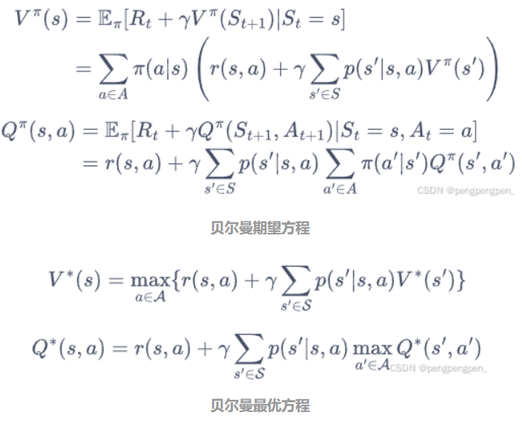

# 一、动态规划算法

## 1.1基础知识介绍:

__动态规划__（dynamic programming）是程序设计算法中非常重要的内容，能够高效解决一些经典问题，例如背包问题和最短路径规划。动态规划的基本思想是将待求解问题分解成若干个子问题，先求解子问题，然后从这些子问题的解得到目标问题的解。动态规划会保存已解决的子问题的答案，在求解目标问题的过程中，需要这些子问题答案时就可以直接利用，避免重复计算。

基于模型的动态规划方法大致上可以分为两种：**策略迭代**和**价值迭代**。**策略迭代**由**策略评估**和**策略提升**组成。**策略迭代**的**策略评估**是用**贝尔曼期望方程**来得到一个策略的状态价值函数，这是一个动态规划的过程；而**价值迭代**是直接使用**贝尔曼最优方程**来进行动态规划，得到最终的最优状态价值。

##  1.2策略迭代过程:

**策略评估**过程用来计算一个策略的状态价值函数。首先我们先回顾一下贝尔曼期望方程(如上图所示)。其中的$π(a|s)$表示策略在状态s下采取动作a的概率。从公式中可以看出，当知道了奖励函数和状态转移函数的时候，我们可以根据下一个状态的价值来计算当前状态的价值，符合动态规划的思想。

**策略提升**过程可以基于策略评估的结果，对策略进行改进。假设此时对于策略，我们已经知道了对应的价值V，后面该如何改变策略来获取在状态s下更高的期望汇报？假设在状态s下采取动作a，之后的动作依旧遵循策略，此时得到的期望汇报就是动作价值$Q^\pi(s, a)$。
如果我们有$Q^\pi(s, a)$>$V^\pi(s)$，则说明在状态s下采取动作a会比原来的策略$π(a|s)$得到更高的期望回报。基于上述假设，我们推而广之:假设存在一个确定性策略$pi'$，在任意一个状态s下，都满足:
$$
Q^\pi(s, \pi'(s)) \geq V^\pi(s)
$$

(后序再补充)