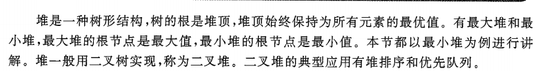
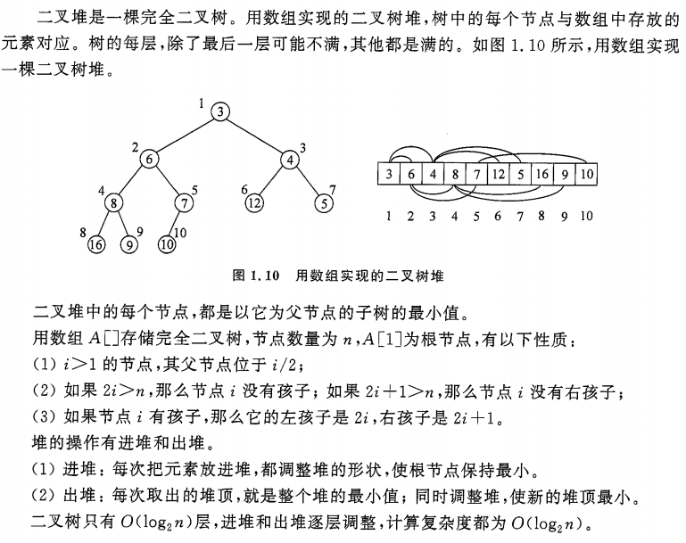
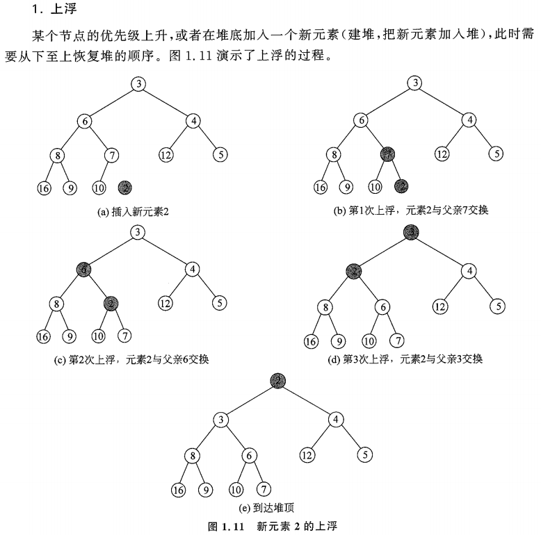
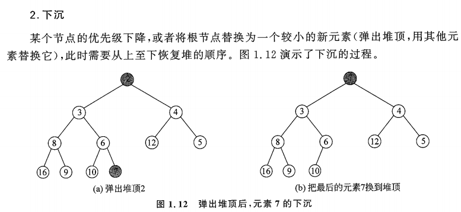
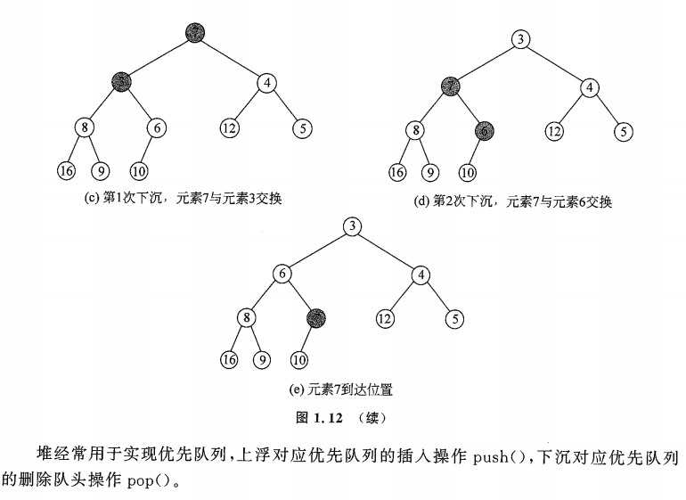

# 🌳 树的算法与题目总结
>此文档记录了与树相关的算法和题目内容，题目来源于洛谷。

## 📌 1. 已知前序后序遍历，求解中序遍历个数

💡 题目来源[洛谷 P1229 - 已知前序后序遍历，求中序遍历个数](https://www.luogu.com.cn/problem/P1229)

## 题目描述

我们都很熟悉二叉树的前序、中序、后序遍历，在数据结构中常提出这样的问题：已知一棵二叉树的前序和中序遍历，求它的后序遍历，相应的，已知一棵二叉树的后序遍历和中序遍历序列你也能求出它的前序遍历。然而给定一棵二叉树的前序和后序遍历，你却不能确定其中序遍历序列，考虑如下图中的几棵二叉树：


所有这些二叉树都有着相同的前序遍历和后序遍历，但中序遍历却不相同。

## 输入格式

共两行，第一行表示该二叉树的前序遍历结果 $s_1$，第二行表示该二叉树的后序遍历结果 $s_2$。


保证至少存在一棵二叉树满足给出的信息，s<sub>1</sub>, s<sub>2</sub>  中只含小写字母，且在某个字符串中不存在相同的字母。

## 输出格式

输出可能的中序遍历序列的总数，结果不超过 $2^{63}-1$。

## 样例 #1

### 样例输入 #1

```
abc                           
cba
```

### 样例输出 #1

```
4
```

## 💡 解题思路
>首先我们需要知道，只有在树中都是一个儿子的时候，才会产生不同的中序遍历结果。例如前序出现AB，后序要出现BA，刚好反过来。于是，我们可以依据这个思想来写代码。

```cpp
#include <iostream>
#include <vector>
using namespace std;
int main(void)
{
  string fir, thi;
  cin >> fir >> thi;
  int result = 0;
  for (int i = 0; i < fir.length(); i++)
  {
    for (int j = 1; j < thi.length(); j++)
    {
      if (fir[i] == thi[j] && fir[i + 1] == thi[j - 1]) //验证是不是前序AB，后序BA的情况
        result++;
    }
  }
  cout << (1 << result); // 按位运算，真是太妙了，左移一位
  return 0;
}
```
## 📌 2.堆


### 2.1 二叉堆基础知识点讲解:


### 2.2 二叉堆的操作:
堆的操作有两种:上浮和下沉。





